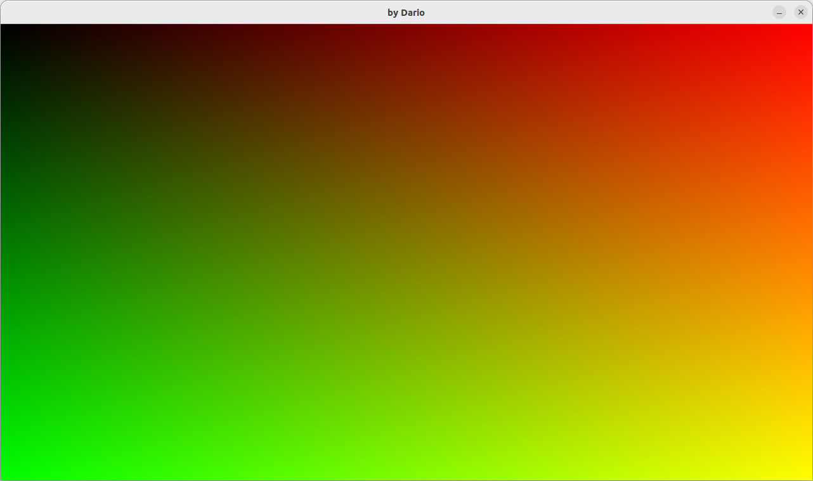
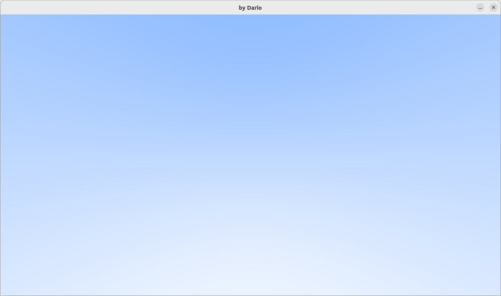
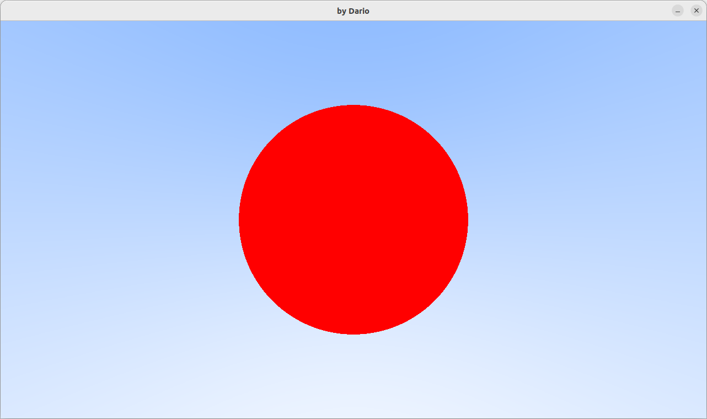
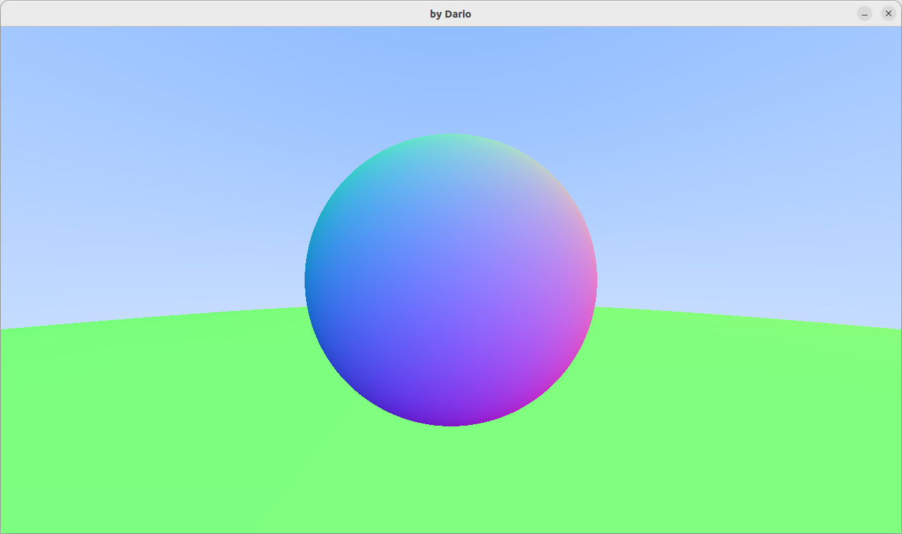
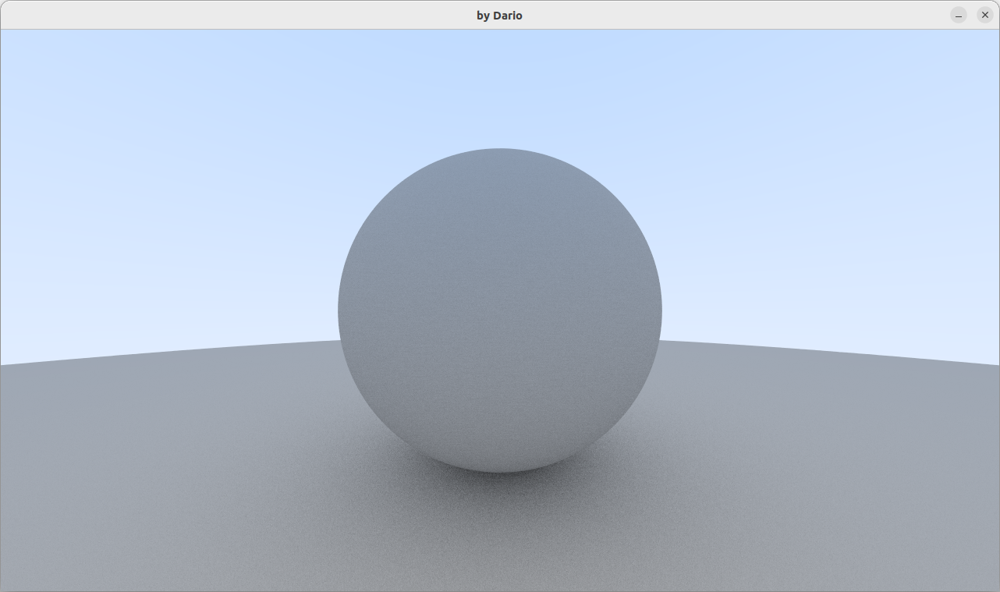
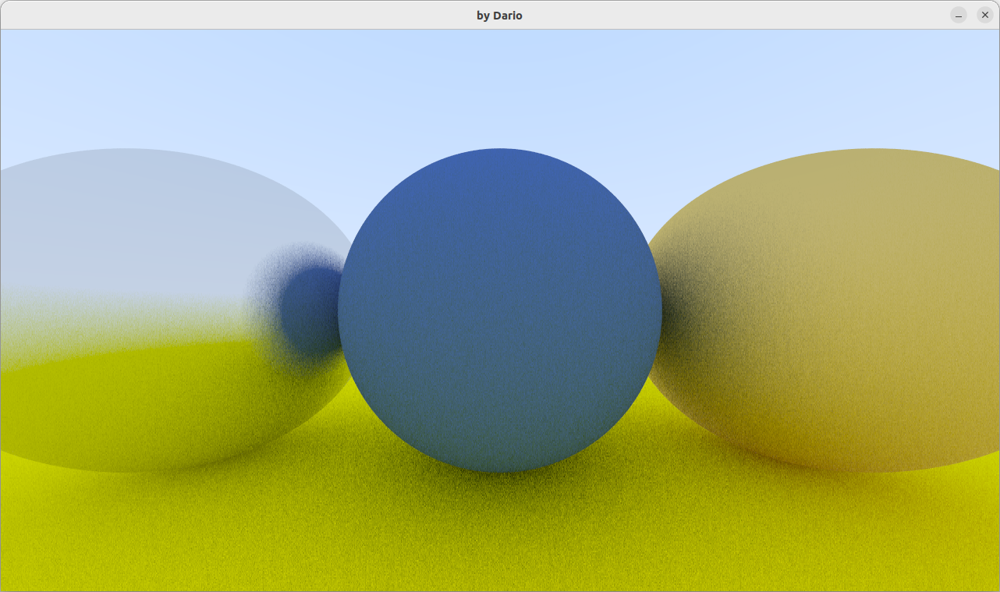
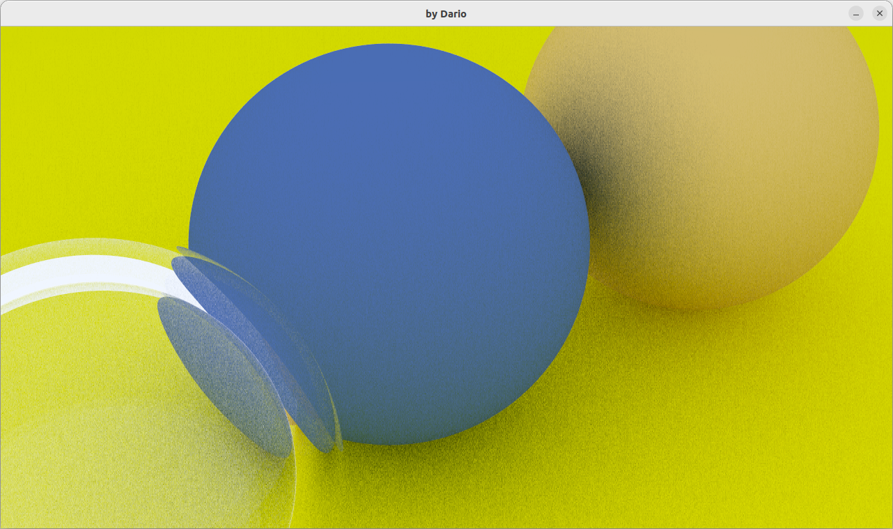

# OwnRay
combine both my approach and JoeAllan 

# Chapter 2. 

# Chapter 4.

# Chapter 5.

# Chapter 6.
## Introduction of abstract class and virtual functions

# Chapter 7. Antialiasing
## Introduction of  curandState_t* states in Cuda

# Chapter 8. Antialiasing
## Camera class as pointer

# Chapter 9. Recursion vs Iteration
## Introduction to diffuse material 

### Notes:
I could use both i and j  but using only i is faster by 3x:
vec3 random_vector(curandState_t* states,  int &i, int &j){
        curandState_t x = states[i];
        // curandState_t y = states[j];
        
        float a = random_float(&x);
        float b = random_float(&x);
        float c = random_float(&x); 
        
        states[i] = x; // save value back
        // states[j] = y; // save value back
        return vec3(a, b, c);
}

# Chapter 10. Abstract class of  Material
## Lambertian and Metal/fuzz

# Chapter 11. Camera movement 

